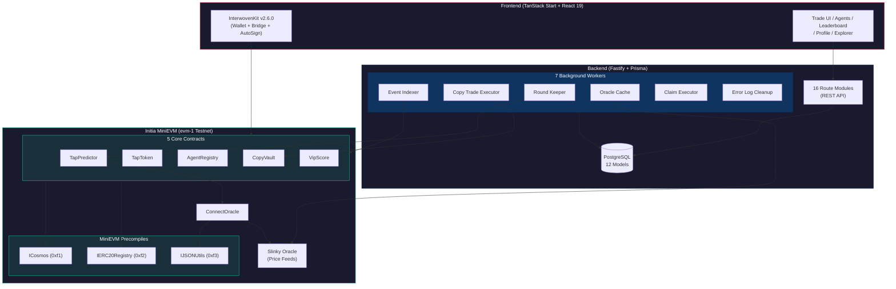
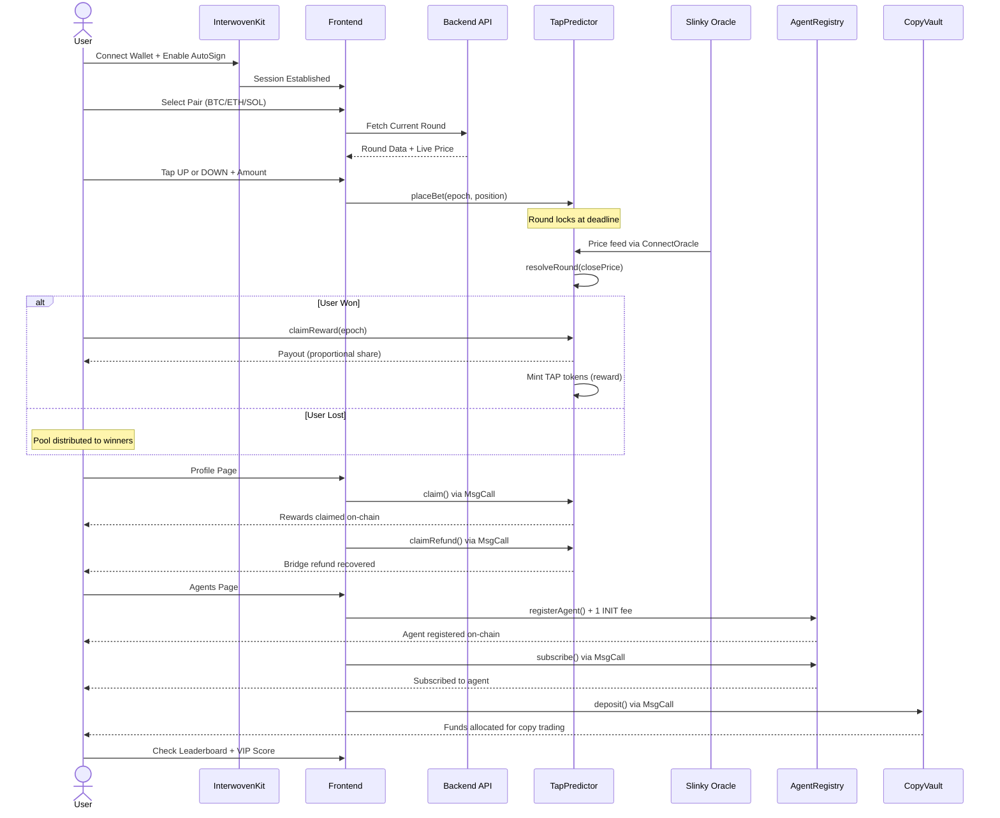
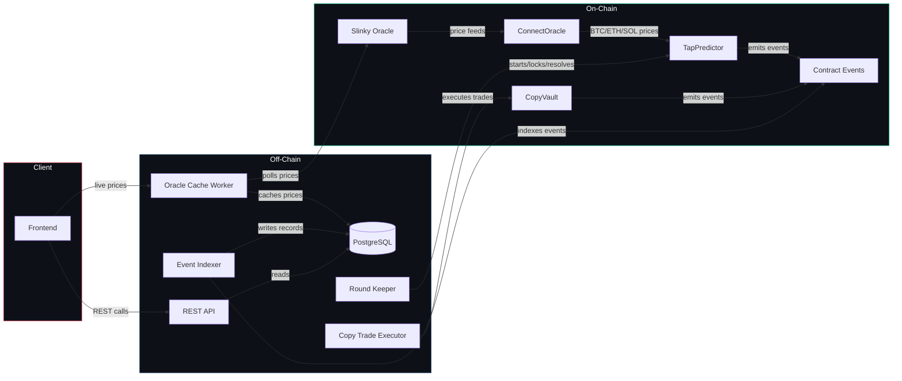

<div align="center">


# INITTAP

### Tap. Predict. Win.

A price prediction trading platform with AI copy-trading agents,
built natively on Initia MiniEVM.

[](https://soliditylang.org)
[](https://book.getfoundry.sh)
[](https://initia.xyz)
[](https://fastify.dev)
[](https://prisma.io)
[](https://postgresql.org)
[](https://tanstack.com/start)
[](https://react.dev)
[](https://tailwindcss.com)
[](https://typescriptlang.org)
[](https://bun.sh)
[](https://vite.dev)

**INITIATE Season 1 Hackathon** | DeFi + AI & Tooling Tracks

[Live Demo](#) · [Architecture](#architecture) · [Quick Start](#quick-start) · [Contracts](#deployed-contracts)

</div>

---

## Initia Hackathon Submission

- **Project Name**: INITTAP

### Project Overview

INITTAP is a tap-to-predict price trading platform with AI copy-trading agents, built natively on Initia MiniEVM. Users predict whether BTC, ETH, or SOL prices go up or down in 3-minute parimutuel rounds, or subscribe to AI agents that trade on their behalf. It solves the fragmented UX of existing prediction markets by integrating Slinky oracle, Ghost Wallet auto-signing, Interwoven Bridge, and .init usernames into a single seamless interface.

### Implementation Detail

- **The Custom Implementation**: A full parimutuel prediction engine (TapPredictor) with dual-side betting, AI agent copy-trading (AgentRegistry + CopyVault), TAP reward tokens, VIP scoring, and a Euphoria-style tap grid UI. Five custom smart contracts totaling 2,100+ lines of Solidity, a Fastify backend with 7 background workers and 16 API route modules, and a TanStack Start frontend with real-time price charts and one-tap trading.
- **The Native Feature**: Auto-signing via Ghost Wallet (`requestTxBlock`) enables one-tap betting without wallet popups on every trade. The Interwoven Bridge is embedded in the trade page for instant cross-chain deposits. Initia usernames (`.init` names) are resolved on the leaderboard and profile pages for human-readable identity.

### How to Run Locally

1. **Contracts**: `cd contract && forge build && forge test` (requires Foundry)
2. **Backend**: `cd backend && bun install && cp .env.example .env` (fill in DATABASE_URL, JWT_SECRET, EVM_RPC_URL, OPERATOR_PRIVATE_KEY), then `bun run db:push && bun dev`
3. **Frontend**: `cd web && bun install && bun dev` (runs on port 3200)
4. Connect with any Initia-compatible wallet via InterwovenKit, enable AutoSign, and start tapping

---

## The Problem

Prediction markets on EVM are siloed, lack native oracle integration, and ignore the interchain future. Users face fragmented UX with bridges, separate wallets, and no gamification. Every interaction requires a wallet popup, every cross-chain move requires a separate bridge app, and every prediction market reinvents its own oracle solution.

## The Solution

INITTAP leverages Initia's full MiniEVM stack to deliver a seamless tap-trading experience. Users predict whether BTC, ETH, or SOL prices go up or down in 3-minute parimutuel rounds, or subscribe to AI copy-trading agents that trade autonomously on their behalf.

Built with Slinky oracle for trustless price feeds, Ghost Wallet for one-tap auto-signing, InterwovenKit for unified wallet UX, and the Interwoven Bridge for cross-chain deposits. All from a single interface.

---

## Architecture



---

## User Flow



---

## Data Flow



---

## Deployed Contracts

All contracts are deployed on the **Initia evm-1 testnet**.

| Contract | Address | Purpose |
|:---------|:--------|:--------|
| **TapPredictor** | `0x615a71c4fc146182A6501E45997D361609829F84` | Core prediction rounds engine |
| **TapToken** | `0xE935dbf15c2418be20Ad0be81A3a2203934d8B3e` | TAP reward token (mint on win) |
| **AgentRegistry** | `0x3582d890fe61189B012Be63f550d54cf6dE1F9DC` | AI agent registration and management |
| **CopyVault** | `0x29238F71b552a5bcC772d830B867B67D37E0af5C` | Copy-trading fund allocation |
| **VipScore** | `0x02dd9E4b05Dd4a67A073EE9746192afE1FA30906` | VIP system for Initia rewards |
| **ConnectOracle** | `0x031ECb63480983FD216D17BB6e1d393f3816b72F` | Slinky oracle price feed helper |

---

## Initia Integration Depth

INITTAP uses Initia's native stack across every layer. This is not a generic EVM app redeployed on Initia. Every feature is purpose-built for MiniEVM.

### Smart Contracts (9/10)

| Feature | Integration |
|:--------|:------------|
| ICosmos (0xf1) | Cross-layer Cosmos message execution |
| IERC20Registry (0xf2) | Native Cosmos coin to ERC20 mapping |
| IJSONUtils (0xf3) | On-chain JSON parsing for oracle responses |
| ConnectOracle | Slinky price feeds via `query_cosmos` |
| ERC20Factory | Agent share token creation |
| ERC20Wrapper | Native INIT wrapping |
| Cosmos Bridging | `ICosmos.execute_cosmos` for bridge calls |
| VIP Score | Tracking for Initia VIP reward system |

### Backend (9/10)

| Feature | Integration |
|:--------|:------------|
| Cosmos Queries | 31 query functions via Initia LCD REST API |
| Oracle Cache | Slinky price polling and caching worker |
| Event Indexer | Indexes events from all 5 contracts |
| Round Keeper | Automated round lifecycle management |
| Copy Trade Executor | Autonomous agent trade execution |
| Bridge Tracking | Interwoven Bridge event monitoring |
| DEX Queries | Router and DEX integration queries |

### Frontend (10/10)

| Feature | Integration |
|:--------|:------------|
| InterwovenKit v2.6.0 | Full provider config with protoTypes, aminoConverters, autoSign |
| 5 @initia/* packages | interwovenkit-react, initia.proto, amino-converter, icons-react, utils |
| 20+ Initia Icons | All third-party icons replaced with native Initia icons |
| 9 Contract Functions | betBull, betBear, claim, claimRefund, registerAgent, subscribe, unsubscribe, deposit, withdraw via MsgCall |
| requestTxBlock | Gas adjustment for transactions |
| .init Names | useUsernameQuery for name resolution |
| Portfolio View | usePortfolio for cross-chain balance display |
| AutoSign | Toggle with expiry display (Ghost Wallet) |
| Bridge UI | openDeposit / openWithdraw integration |
| Initia Scan | Direct links to Initia block explorer |
| On-chain Claims | `TapPredictor.claim()` directly from profile via MsgCall |
| Bridge Refund Recovery | `TapPredictor.claimRefund()` for failed bridge callbacks |
| Agent Registration | `AgentRegistry.registerAgent()` with 1 INIT fee via MsgCall |
| Agent Subscribe/Unsubscribe | `AgentRegistry.subscribe/unsubscribe()` via MsgCall |
| CopyVault Deposit/Withdraw | `CopyVault.deposit/withdraw()` for copy trading |
| Your Rank Display | Personalized rank banner on leaderboard |
| Agent Trade History | Full trade table on agent detail pages |

---

## Project Structure

```
inittap/
├── contract/               # Foundry smart contracts (2,112 LOC + 4,060 LOC tests)
│   ├── src/                # 5 core contracts + interfaces + libs
│   │   ├── TapPredictor.sol
│   │   ├── TapToken.sol
│   │   ├── AgentRegistry.sol
│   │   ├── CopyVault.sol
│   │   ├── VipScore.sol
│   │   ├── interfaces/
│   │   └── lib/
│   ├── test/               # 4 comprehensive test suites
│   ├── script/             # Deployment scripts
│   └── deployments/        # Deployment records
│
├── backend/                # Fastify API server
│   ├── src/routes/         # 16 route modules
│   ├── src/workers/        # 7 background workers
│   ├── src/lib/            # Cosmos + EVM + Router integrations
│   └── prisma/             # 12 database models
│
└── web/                    # TanStack Start frontend
    ├── src/routes/         # 7 pages
    │   └── _app/
    │       ├── trade.tsx
    │       ├── leaderboard.tsx
    │       ├── profile.tsx
    │       ├── agents.tsx
    │       └── explorer.tsx
    ├── src/providers/      # Wallet + UI providers
    ├── src/lib/            # API client + contract ABIs
    └── src/components/     # Shared UI components
```

---

## Screenshots

<div align="center">

| Trade | Leaderboard |
|:-----:|:-----------:|
|  |  |

| Profile | Agents |
|:-------:|:------:|
|  |  |

| Explorer |
|:--------:|
|  |

</div>

---

## Quick Start

### Prerequisites

- [Bun](https://bun.sh) (runtime and package manager)
- [Foundry](https://book.getfoundry.sh) (smart contract toolchain)
- [PostgreSQL](https://postgresql.org) (database)

### Smart Contracts

```bash
cd contract
forge build
forge test
```

### Backend

```bash
cd backend
bun install
bun run db:push
bun dev
```

### Frontend

```bash
cd web
bun install
bun dev
```

---

## API Overview

The backend exposes 16 route modules via Fastify:

| Module | Description |
|:-------|:------------|
| `authRoutes` | Wallet authentication |
| `roundRoutes` | Round lifecycle (current, history, results) |
| `priceRoutes` | Live and cached oracle prices |
| `userRoutes` | User profiles and stats |
| `agentRoutes` | AI agent CRUD and performance |
| `leaderboardRoutes` | Rankings by win rate, volume, streaks |
| `statsRoutes` | Platform-wide statistics |
| `bridgeRoutes` | Bridge transaction tracking |
| `chainRoutes` | On-chain data queries |
| `dexRoutes` | DEX and liquidity pool data |
| `tokenRoutes` | Token balances and metadata |
| `vipRoutes` | VIP score and rewards |
| `usernameRoutes` | .init name resolution |
| `routerRoutes` | Swap routing queries |
| `rollyticsRoutes` | Rollup analytics |

---

## Background Workers

| Worker | Responsibility |
|:-------|:---------------|
| **Round Keeper** | Starts new rounds, locks betting, triggers resolution |
| **Oracle Cache** | Polls Slinky oracle and caches prices in PostgreSQL |
| **Event Indexer** | Indexes on-chain events from all 5 contracts |
| **Copy Trade Executor** | Executes trades for subscribed copy-trading vaults |
| **Claim Executor** | Auto-claims rewards for eligible users |
| **Error Log Cleanup** | Prunes old error records from the database |

---

## How It Works

**1. Round Lifecycle**
Each prediction round lasts 3 minutes. The Round Keeper worker starts a new round, opening a betting window. Users tap UP or DOWN and stake INIT tokens. When the betting window closes, the round locks at the current Slinky oracle price.

**2. Resolution**
After the round duration elapses, the Round Keeper calls `resolveRound` on the TapPredictor contract, which fetches the close price from Slinky via the ConnectOracle helper. Winners split the losing pool proportionally to their stake.

**3. TAP Rewards**
Winners receive TAP tokens minted by the TapToken contract, which accumulate VIP score and unlock tiered rewards through the VipScore contract. Users can claim rewards directly from the profile page.

**4. AI Agents**
Users register AI agent strategies from the agents page (1 INIT fee) via `AgentRegistry.registerAgent()`. Followers subscribe to agents and deposit into copy-trading vaults. The Copy Trade Executor worker monitors active agents, executes their predictions through CopyVault, and distributes profits. Followers pay a 10% performance fee (70% to the agent creator, 30% to the platform).

**5. Cross-Chain Deposits**
Users bridge assets from any Interwoven chain directly through the InterwovenKit bridge UI. The ICosmos precompile handles Cosmos-level message execution, while IERC20Registry maps native Cosmos coins to their ERC20 representations. Bridge refund recovery is available on the profile page via `TapPredictor.claimRefund()`.

---

## MiniEVM Precompiles

| Address | Interface | Usage in INITTAP |
|:--------|:----------|:-----------------|
| `0xf1` | ICosmos | Execute Cosmos messages from EVM contracts (bridging, IBC) |
| `0xf2` | IERC20Registry | Map native Cosmos coins to ERC20 tokens for seamless usage |
| `0xf3` | IJSONUtils | Parse JSON oracle responses on-chain without external libraries |

---

## Revenue Model

| Source | Fee | Distribution |
|:-------|:----|:-------------|
| Trading Volume | 3% treasury fee on all pools | Protocol treasury |
| Agent Performance | 10% of follower profits | 70% creator, 30% platform |
| Bridge Activity | Network fees | Initia validators |

---

<div align="center">

### Built for INITIATE Season 1

$25K Prize Pool | DeFi + AI & Tooling Tracks

Built with Initia's full MiniEVM stack. Every feature is native. Every integration is real.

9/9 user-callable contract functions wired to the frontend.
19 backend endpoints actively consumed.
Zero inert buttons. Every action works on-chain.

</div>
