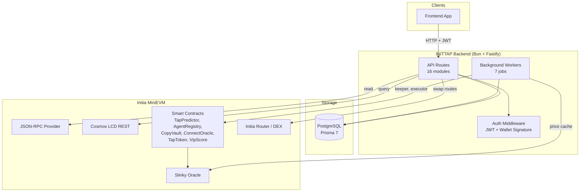
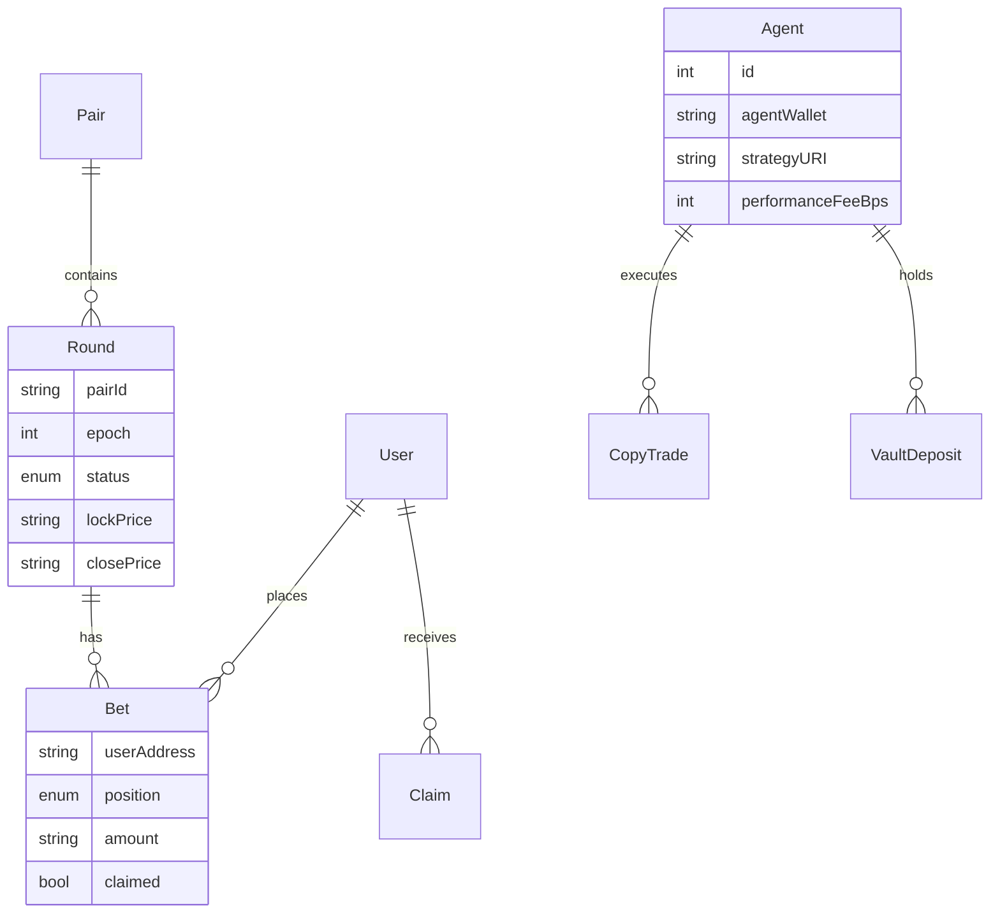

<p align="center">
  <h1 align="center">INITTAP Backend</h1>
  <p align="center">API server and on-chain workers for the INITTAP price prediction platform on Initia MiniEVM</p>
</p>

<p align="center">
  
  
  
  
  
  
</p>

---

## Quick Start

```bash
# Install dependencies
bun install

# Configure environment (see Environment Variables below)
cp .env.example .env

# Push Prisma schema to database
bun run db:push

# Start development server with hot reload
bun dev
```

The server starts on port **3700** by default.

---

## Architecture



---

## API Routes

All routes are registered with prefixes in `index.ts`. A root `GET /` health check returns `{ status: "ok" }`.

| Module | Prefix | Purpose |
|--------|--------|---------|
| `authRoutes` | `/auth` | Wallet signature authentication, JWT issuance |
| `userRoutes` | `/user` | User profile and settings |
| `roundRoutes` | `/rounds` | Round data: live, history, by epoch |
| `priceRoutes` | `/prices` | Oracle price feeds from Slinky |
| `leaderboardRoutes` | `/leaderboard` | Trader rankings by wins, volume, PnL |
| `statsRoutes` | `/stats` | Platform-wide statistics |
| `agentRoutes` | `/agents` | AI agent registry queries |
| `bridgeRoutes` | `/bridge` | Bridge event tracking |
| `chainRoutes` | `/chain` | Chain info and block height |
| `dexRoutes` | `/dex` | DEX/swap integration |
| `tokenRoutes` | `/token` | Token metadata and balances |
| `usernameRoutes` | `/usernames` | Initia `.init` username resolution |
| `vipRoutes` | `/vip` | VIP score and tier queries |
| `rollyticsRoutes` | `/rollytics` | Rollup analytics |
| `routerRoutes` | `/router` | Initia Router integration |
| `exampleRoutes` | `/example` | Development and testing |

### Response Format

All endpoints return a consistent shape:

```json
{
  "success": true,
  "error": null,
  "data": { }
}
```

On error:

```json
{
  "success": false,
  "error": { "code": "ERROR_CODE", "message": "Human readable message" },
  "data": null,
  "timestamp": "2026-04-18T00:00:00.000Z"
}
```

### Authentication

Protected routes use JWT via the `authMiddleware` preHandler. Obtain a token through `POST /auth` with a wallet signature, then pass it as a `Bearer` token in the `Authorization` header.

### Rate Limiting

All endpoints are rate-limited to **100 requests per minute** per IP, enforced by `@fastify/rate-limit`.

---

## Frontend Connection

19 of 66 backend endpoints are actively consumed by the frontend. The remaining endpoints serve admin, infrastructure, or features handled natively by the InterwovenKit SDK (bridging, usernames, routing).

| Endpoint | Frontend Page | Data |
|----------|--------------|------|
| `POST /auth/nonce` | useAuth hook | Wallet auth |
| `POST /auth/verify` | useAuth hook | JWT token |
| `GET /user/profile` | profile.tsx | Profile + stats |
| `GET /user/bets` | profile.tsx | Bet history |
| `GET /user/claimable` | profile.tsx | Claimable rewards |
| `GET /rounds/live` | explorer.tsx | Live rounds |
| `GET /rounds/history` | trade.tsx, explorer.tsx | Past rounds |
| `GET /rounds/:pairId/current` | trade.tsx | Active round |
| `GET /prices` | trade.tsx, index.tsx | Oracle prices |
| `GET /leaderboard/top` | leaderboard.tsx | Rankings |
| `GET /leaderboard/user/:address` | leaderboard.tsx | Personal rank |
| `GET /agents` | agents.tsx | Agent list |
| `GET /agents/:agentId` | agents/$agentId.tsx | Agent detail |
| `GET /agents/:agentId/trades` | agents/$agentId.tsx | Trade history |
| `GET /stats/platform` | index.tsx, explorer.tsx | Platform stats |
| `GET /chain/info` | explorer.tsx | Chain metadata |
| `GET /token/balance/:address` | profile.tsx | TAP balance |
| `GET /vip/score/:address` | profile.tsx | VIP score |
| `GET /bridge/refund/:address` | profile.tsx | Pending refunds |

---

## Background Workers

Workers run on fixed intervals using `node-cron`. Each worker uses an `isRunning` guard to prevent overlapping executions.

| Worker | Interval | Purpose |
|--------|----------|---------|
| `oracleCache` | 5s | Cache Slinky oracle prices for BTC/USD, ETH/USD, SOL/USD |
| `eventIndexer` | 3s | Index contract events: bets, claims, rounds, agents, vault deposits |
| `roundKeeper` | 2s | Start new rounds, lock and close expired rounds on-chain |
| `copyTradeExecutor` | 5s | Execute agent copy trades via CopyVault for LIVE rounds |
| `claimExecutor` | 10s | Auto-claim expired winning bets |
| `errorLogCleanup` | Every hour | Cap error log table at 10,000 records |

Workers start in dependency order: oracle cache and event indexer first (provide data), then round keeper, copy trade executor, and claim executor.

---

## Database Models

12 Prisma models backed by PostgreSQL. Schema lives at `prisma/schema.prisma`.

| Model | Domain | Description |
|-------|--------|-------------|
| `User` | Core | Wallet address, nonce for signature auth |
| `ErrorLog` | Core | Structured error logging with auto-cleanup |
| `Pair` | Prediction Market | Trading pairs (BTC/USD, ETH/USD, SOL/USD) |
| `Round` | Prediction Market | Round lifecycle: LIVE, LOCKED, ENDED, CANCELLED |
| `Bet` | Prediction Market | Bull/Bear positions with amounts in wei |
| `Claim` | Prediction Market | Reward claims with tx receipts |
| `Agent` | Copy Trading | AI agent profiles, performance stats, strategy URIs |
| `CopyTrade` | Copy Trading | Agent trades replicated for followers |
| `VaultDeposit` | Copy Trading | Follower deposits and withdrawals |
| `OraclePrice` | Oracle | Cached Slinky prices with nonce and block height |
| `IndexerCursor` | Indexer | Singleton tracking last indexed block |
| `UserStats` | Leaderboard | Aggregated stats: wins, streaks, volume, PnL |
| `BridgeEvent` | Bridge | L1 bridge events, callbacks, refunds |



---

## Initia Integration

### EVM Layer (`src/lib/evm/`)

- **Provider** (`provider.ts`): JSON-RPC connection to MiniEVM (chain ID `2124225178762456`)
- **Signer** (`signer.ts`): Server-side transaction signing for keeper and executor operations
- **Contract ABIs** (`abi/`): 6 contract interfaces:
  - `TapPredictor.json` (prediction rounds and bets)
  - `AgentRegistry.json` (AI agent registration)
  - `CopyVault.json` (follower deposit and copy trading)
  - `ConnectOracle.json` (Slinky oracle bridge)
  - `TapToken.json` (TAP ERC-20)
  - `VipScore.json` (VIP tier tracking)

### Cosmos Layer (`src/lib/cosmos/`)

- **REST Client** (`client.ts`): 31 query functions against the Initia LCD API
  - Account balances, staking delegations, governance proposals
  - IBC transfers and channel queries
  - Bank, distribution, slashing module params

### Router (`src/lib/router/`)

- **Router Client** (`client.ts`): Initia Router / DEX integration for swap route queries

---

## Project Structure

```
backend/
├── index.ts                  # Entry point: route and worker registration
├── dotenv.ts                 # Environment variable loader
├── Dockerfile                # Container build
├── prisma/
│   └── schema.prisma         # 12 models, full prediction market schema
├── src/
│   ├── config/
│   │   └── main-config.ts    # Centralized env config with startup validation
│   ├── routes/               # 16 API route modules
│   ├── workers/              # 7 background workers
│   ├── middlewares/
│   │   └── authMiddleware.ts # JWT verification preHandler
│   ├── lib/
│   │   ├── prisma.ts         # Database client singleton
│   │   ├── cosmos/           # Initia Cosmos REST client (31 functions)
│   │   ├── evm/              # Provider, signer, 6 contract ABIs
│   │   └── router/           # Initia Router client
│   └── utils/
│       ├── errorHandler.ts   # Centralized error responses + DB logging
│       ├── validationUtils.ts# Request body validation
│       ├── timeUtils.ts      # Timestamp helpers
│       └── miscUtils.ts      # IDs, address formatting, sleep
```

---

## Environment Variables

Required variables are validated at startup. The server will exit immediately if any are missing.

### Always Required

| Variable | Description |
|----------|-------------|
| `DATABASE_URL` | PostgreSQL connection string |
| `JWT_SECRET` | JWT signing key (minimum 32 characters) |
| `EVM_RPC_URL` | MiniEVM JSON-RPC endpoint |
| `OPERATOR_PRIVATE_KEY` | Server wallet private key for keeper/executor transactions |

### Required in Production

| Variable | Description |
|----------|-------------|
| `TAPPREDICTOR_ADDRESS` | TapPredictor contract address |
| `AGENTREGISTRY_ADDRESS` | AgentRegistry contract address |
| `COPYVAULT_ADDRESS` | CopyVault contract address |
| `CONNECT_ORACLE_ADDRESS` | ConnectOracle contract address |
| `TAPTOKEN_ADDRESS` | TAP ERC-20 token address |
| `VIPSCORE_ADDRESS` | VipScore contract address |
| `CORS_ORIGIN` | Comma-separated allowed origins |

### Optional (with defaults)

| Variable | Default | Description |
|----------|---------|-------------|
| `APP_PORT` | `3700` | Server listen port |
| `NODE_ENV` | `development` | Environment mode |
| `JWT_EXPIRES_IN` | `24h` | Token expiration duration |
| `CHAIN_ID` | `2124225178762456` | MiniEVM chain ID |
| `COSMOS_REST_URL` | Initia testnet LCD | Cosmos REST API endpoint |
| `CORS_ORIGIN` | `localhost:3000,5173` | Allowed CORS origins (dev) |

---

## Scripts

| Command | Description |
|---------|-------------|
| `bun dev` | Start with hot reload (watch mode) |
| `bun start` | Start in production mode |
| `bun run db:push` | Push Prisma schema to database and regenerate client |
| `bun run db:pull` | Pull database schema into Prisma |
| `bun run db:generate` | Regenerate Prisma client |
| `bun run db:migrate` | Run Prisma migrations |
| `bun run typecheck` | TypeScript type checking |
| `bun run lint` | ESLint |

---

## Security

- **Helmet** headers enabled (CSP disabled for API-only service)
- **Rate limiting** at 100 req/min per IP
- **CORS** restricted to configured origins
- **JWT authentication** with wallet signature verification
- **Body size limit** capped at 1 MB
- **Graceful shutdown** on SIGTERM and SIGINT
- Required env vars validated at startup (fail-fast)

---

## Tech Stack

| Layer | Technology |
|-------|------------|
| Runtime | [Bun](https://bun.sh) |
| Framework | [Fastify 5.6](https://fastify.dev) |
| Database | PostgreSQL + [Prisma 7](https://www.prisma.io) |
| Language | TypeScript 5.7 |
| Blockchain (EVM) | [ethers.js 6](https://docs.ethers.org/v6/) |
| Blockchain (Cosmos) | Custom REST client for Initia LCD |
| Scheduling | [node-cron](https://github.com/node-cron/node-cron) |
| Auth | JWT via [jsonwebtoken](https://github.com/auth0/node-jsonwebtoken) |
