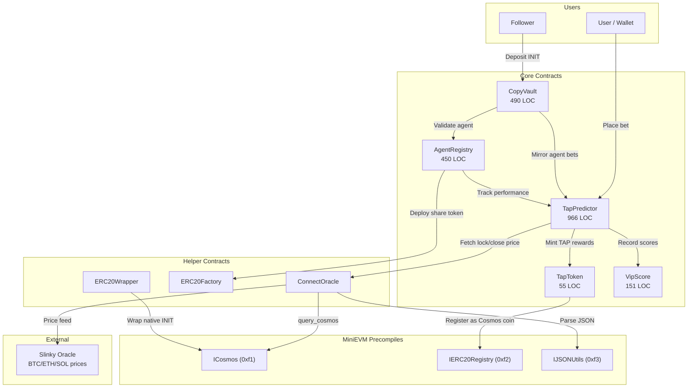
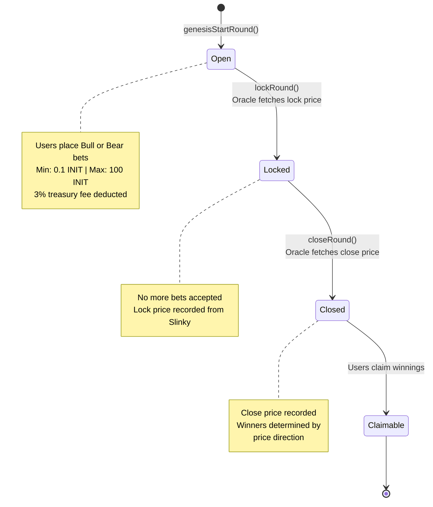

<p align="center">
  <h1 align="center">INITTAP Contracts</h1>
  <p align="center">Price prediction trading engine on Initia MiniEVM</p>
</p>

<p align="center">
  
  
  
  
  
</p>

---

INITTAP lets users predict short-term price movements of BTC, ETH, and SOL. Each round lasts 3 minutes. Pick Bull or Bear, and if the close price moves in your direction, you win a share of the pool. AI agents can trade autonomously, and followers can copy their strategies through on-chain vaults.

## Quick Start

```bash
# Install dependencies
forge install

# Build contracts
forge build

# Run tests
forge test

# Run tests with detailed traces
forge test -vvv
```

## Architecture



## Round Lifecycle

Each prediction round follows a fixed 3-minute cycle driven by oracle price feeds.



## Contracts

### TapPredictor.sol

The core prediction market engine. Manages rounds, accepts bets, resolves outcomes, and distributes rewards.

| Parameter | Value |
|-----------|-------|
| Min bet | 0.1 INIT |
| Max bet | 100 INIT |
| Treasury fee | 3% |
| Round duration | 3 minutes |
| Supported pairs | BTC/USD, ETH/USD, SOL/USD |

Key responsibilities:
- Starts, locks, and closes prediction rounds
- Fetches lock/close prices via ConnectOracle (Slinky)
- Mints TAP token rewards on each bet
- Forwards copy-trade signals to CopyVault
- Reports user activity to VipScore

### TapToken.sol

ERC20 reward token minted when users place bets. Only the TapPredictor contract can mint.

Uses the `IERC20Registry` precompile at `0xf2` to register as a Cosmos-native coin, making it bridgeable across the Initia ecosystem via IBC.

### AgentRegistry.sol

Registry for AI trading agents with on-chain performance tracking.

| Parameter | Value |
|-----------|-------|
| Registration fee | 1 INIT |
| Share token | ERC20, deployed per agent via ERC20Factory |

Tracks wins, total trades, and PnL for each agent. Handles activation and deactivation.

### CopyVault.sol

Pooled vault that mirrors agent trades on behalf of followers.

- Followers deposit INIT to subscribe to a specific agent
- When the agent places a bet, follower funds are proportionally allocated
- Performance fees distributed to agents on claim
- VIP score bonuses applied based on tier

### VipScore.sol

Tracks cumulative user activity scores for Initia's VIP reward system. Only allowlisted callers (TapPredictor, CopyVault) can update scores. Supports per-stage tracking aligned with Initia's native VIP infrastructure.

## MiniEVM Precompiles

These are Initia-specific precompiled contracts that bridge EVM and Cosmos functionality.

| Precompile | Address | Used In | Purpose |
|------------|---------|---------|---------|
| ICosmos | `0xf1` | ConnectOracle, TapToken | Execute Cosmos messages, query Cosmos state |
| IERC20Registry | `0xf2` | TapToken | Register ERC20 as native Cosmos coin |
| IJSONUtils | `0xf3` | ConnectOracle | Parse JSON oracle responses on-chain |

## Helper Contracts

| Contract | Purpose |
|----------|---------|
| ConnectOracle | Wraps Slinky oracle price queries via `ICosmos.query_cosmos` |
| ERC20Factory | Deploys per-agent share tokens for the AgentRegistry |
| ERC20Wrapper | Wraps native INIT for EVM usage |

## Contract Wiring

How contracts reference each other after deployment:

```
predictor.tapToken      -> TapToken       (mint rewards)
predictor.copyVault     -> CopyVault      (copy trade execution)
predictor.erc20Wrapper  -> ERC20Wrapper   (native INIT wrapping)
registry.predictor      -> TapPredictor   (performance tracking)
registry.erc20Factory   -> ERC20Factory   (share token deployment)
vault.predictor         -> TapPredictor   (bet placement)
vault.registry          -> AgentRegistry  (agent validation)
tapToken.minter         -> TapPredictor   (sole minter)
```

## Frontend Integration

All user-callable contract functions are wired to the frontend. Transactions are submitted via InterwovenKit's `requestTxBlock` with `MsgCall` encoding on the `evm-1` chain.

| Contract | Function | Frontend Page | Payable |
|----------|----------|---------------|---------|
| TapPredictor | `betBull(bytes32, uint256)` | trade.tsx | Yes |
| TapPredictor | `betBear(bytes32, uint256)` | trade.tsx | Yes |
| TapPredictor | `claim(bytes32[], uint256[])` | profile.tsx | No |
| TapPredictor | `claimRefund()` | profile.tsx | No |
| AgentRegistry | `registerAgent(address, string, uint16)` | agents.tsx | Yes (1 INIT) |
| AgentRegistry | `subscribe(uint256)` | agents/$agentId.tsx | Yes (0.5 INIT min) |
| AgentRegistry | `unsubscribe(uint256)` | agents/$agentId.tsx | No |
| CopyVault | `deposit(uint256)` | agents/$agentId.tsx | Yes |
| CopyVault | `withdraw(uint256, uint256)` | agents/$agentId.tsx | No |

## Deployment (Initia evm-1 Testnet)

| Property | Value |
|----------|-------|
| Chain ID | `2124225178762456` |
| RPC | `https://jsonrpc-evm-1.anvil.asia-southeast.initia.xyz` |
| Explorer | `https://scan.testnet.initia.xyz/evm-1` |

### Contract Addresses

| Contract | Address |
|----------|---------|
| TapPredictor | [`0x790080F8232a7b82321459e1BaAf8100665d9485`](https://scan.testnet.initia.xyz/evm-1/contracts/0x790080F8232a7b82321459e1BaAf8100665d9485) |
| TapToken | [`0xE935dbf15c2418be20Ad0be81A3a2203934d8B3e`](https://scan.testnet.initia.xyz/evm-1/contracts/0xE935dbf15c2418be20Ad0be81A3a2203934d8B3e) |
| AgentRegistry | [`0x3582d890fe61189B012Be63f550d54cf6dE1F9DC`](https://scan.testnet.initia.xyz/evm-1/contracts/0x3582d890fe61189B012Be63f550d54cf6dE1F9DC) |
| CopyVault | [`0x29238F71b552a5bcC772d830B867B67D37E0af5C`](https://scan.testnet.initia.xyz/evm-1/contracts/0x29238F71b552a5bcC772d830B867B67D37E0af5C) |
| VipScore | [`0x02dd9E4b05Dd4a67A073EE9746192afE1FA30906`](https://scan.testnet.initia.xyz/evm-1/contracts/0x02dd9E4b05Dd4a67A073EE9746192afE1FA30906) |
| ConnectOracle | [`0x031ECb63480983FD216D17BB6e1d393f3816b72F`](https://scan.testnet.initia.xyz/evm-1/contracts/0x031ECb63480983FD216D17BB6e1d393f3816b72F) |
| ERC20Factory | [`0xf108dc9560D3e547270c1B6A334501b71d2F2321`](https://scan.testnet.initia.xyz/evm-1/contracts/0xf108dc9560D3e547270c1B6A334501b71d2F2321) |
| ERC20Wrapper | [`0x7FD385d69908247436f49de2A1AFf6438d75C3c0`](https://scan.testnet.initia.xyz/evm-1/contracts/0x7FD385d69908247436f49de2A1AFf6438d75C3c0) |

## Testing

4 test suites covering all core contracts:

| Test Suite | Lines |
|------------|-------|
| TapPredictor.t.sol | 1,370 |
| CopyVault.t.sol | 1,236 |
| AgentRegistry.t.sol | 1,111 |
| TapToken.t.sol | 343 |
| **Total** | **4,060** |

```bash
# Run all tests
forge test

# Run a specific test file
forge test --match-path test/TapPredictor.t.sol

# Run with gas reporting
forge test --gas-report

# Run with verbosity for debugging
forge test -vvvv
```

## Foundry Configuration

| Setting | Value |
|---------|-------|
| Solidity compiler | 0.8.24 |
| EVM version | Shanghai |
| Optimizer | Enabled, 200 runs |
| via_ir | true |
| Line length | 120 |
| Tab width | 4 |

## Project Structure

```
contract/
  src/
    TapPredictor.sol       # Core prediction engine
    TapToken.sol           # ERC20 reward token
    AgentRegistry.sol      # AI agent registry
    CopyVault.sol          # Copy-trading vault
    VipScore.sol           # VIP score tracker
    interfaces/            # Contract interfaces
    lib/                   # Utility libraries
  test/                    # Foundry test suites
  script/                  # Deployment scripts
  deployments/             # Deployment artifacts
  foundry.toml             # Foundry configuration
```
