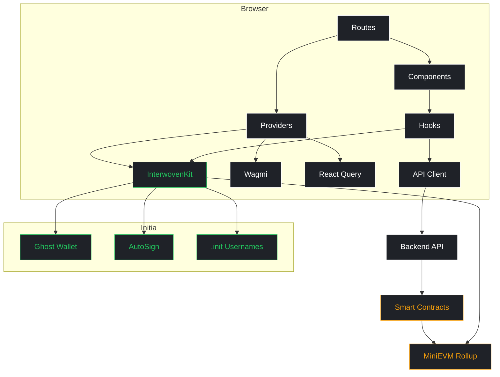
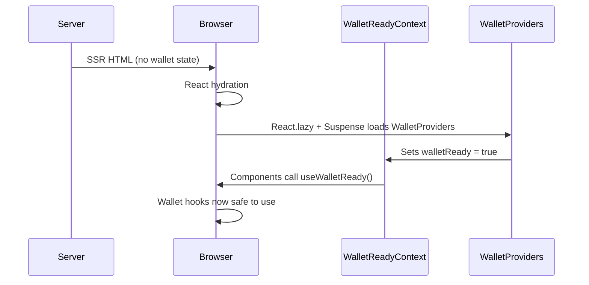

<div align="center">

# INITTAP

**Price prediction trading on Initia MiniEVM**

[](https://react.dev)
[](https://tanstack.com/start)
[](https://initia.xyz)
[](https://www.typescriptlang.org)
[](https://tailwindcss.com)
[](https://bun.sh)

Predict whether asset prices go up or down. Place bets on live rounds. Compete on the leaderboard. Let AI agents trade for you.

</div>

---

## Quick Start

```bash
bun install
bun dev            # Dev server on localhost:3200
```

Open [http://localhost:3200](http://localhost:3200) and connect your Initia wallet.

### Other Commands

```bash
bun build          # Production build
bun preview        # Preview production build
bun lint           # ESLint
bun check          # Prettier + ESLint fix
bun test           # Vitest
```

## Architecture



## Tech Stack

| Layer           | Technology                            |
| --------------- | ------------------------------------- |
| Framework       | TanStack Start (SSR meta-framework)   |
| UI              | React 19                              |
| Routing         | TanStack Router (file-based)          |
| Data            | TanStack Query                        |
| Styling         | Tailwind CSS 4                        |
| Animation       | Motion (Framer Motion) + GSAP + Lenis |
| Build           | Vite 7 + Nitro                        |
| Language        | TypeScript (strict)                   |
| Package Manager | Bun                                   |
| Wallet          | InterwovenKit + Wagmi                 |
| Components      | HeroUI                                |

## Routes

| Route          | File                       | Description                                                                           |
| -------------- | -------------------------- | ------------------------------------------------------------------------------------- |
| `/`            | `index.tsx`                | Landing page with hero, stats, and features                                           |
| `/trade`       | `_app/trade.tsx`           | Core trading interface with live rounds and bet modal                                 |
| `/leaderboard` | `_app/leaderboard.tsx`     | Trader rankings with `.init` username resolution, with personal rank banner           |
| `/profile`     | `_app/profile.tsx`         | Wallet portfolio, bet history, AutoSign toggle, claim rewards, bridge refund recovery |
| `/agents`      | `_app/agents.tsx`          | AI agent cards with performance stats, register new agents                            |
| `/agents/:id`  | `_app/agents/$agentId.tsx` | Agent detail with strategy, subscribe, deposit/withdraw copy vault, trade history     |
| `/explorer`    | `_app/explorer.tsx`        | Initia ecosystem links (Glyph, DEX, VIP)                                              |

All `_app/` routes share a common layout with the Navbar component.

## Initia SDK Integration

INITTAP integrates deeply with the Initia ecosystem through five `@initia/*` packages.

### Packages

| Package                       | Version | Purpose                                                            |
| ----------------------------- | ------- | ------------------------------------------------------------------ |
| `@initia/interwovenkit-react` | v2.6.0  | Wallet connection, signing, AutoSign, portfolio, usernames         |
| `@initia/initia.proto`        |         | MsgCall type for MiniEVM transaction encoding                      |
| `@initia/amino-converter`     |         | protoRegistry and aminoConverters for Cosmos tx signing            |
| `@initia/icons-react`         |         | 20+ icons used across all pages                                    |
| `@initia/utils`               |         | truncate, fromBaseUnit, formatNumber, formatPercent, InitiaAddress |

### InterwovenKit Configuration

The wallet provider is configured with:

- **Network**: TESTNET targeting `evm-1` (MiniEVM rollup)
- **AutoSign**: Scoped to `/minievm.evm.v1.MsgCall` only, with custom gas multiplier and allowed fee denoms
- **Proto/Amino**: Full protoTypes and aminoConverters registration for Cosmos signing

### Key Hooks

| Hook               | Source              | Usage                                                |
| ------------------ | ------------------- | ---------------------------------------------------- |
| `useInterwovenKit` | interwovenkit-react | Wallet connection, `requestTxBlock` for transactions |
| `useAddress`       | interwovenkit-react | Current bech32 address                               |
| `useHexAddress`    | interwovenkit-react | Current hex (EVM) address                            |
| `useInitiaAddress` | interwovenkit-react | Initia-prefixed address                              |
| `useUsernameQuery` | interwovenkit-react | `.init` username resolution                          |
| `usePortfolio`     | interwovenkit-react | Cross-chain token balances                           |

### Transaction Flow

All on-chain actions use `requestTxBlock` with `MsgCall` and auto gas estimation:

1. Build `MsgCall` with sender (bech32), contract address (hex), input calldata (hex without `0x`), and value (wei string)
2. Call `requestTxBlock` with `gasAdjustment` for automatic gas estimation
3. AutoSign handles signing without wallet popups when enabled

**Supported transaction types (9 total):**

| Function        | Contract      | Payable | Notes                          |
| --------------- | ------------- | ------- | ------------------------------ |
| `betBull`       | TapPredictor  | Yes     | Bet on price going up          |
| `betBear`       | TapPredictor  | Yes     | Bet on price going down        |
| `claim`         | TapPredictor  | No      | Claim round winnings           |
| `claimRefund`   | TapPredictor  | No      | Claim refund for failed rounds |
| `registerAgent` | AgentRegistry | Yes     | Register AI agent (1 INIT)     |
| `subscribe`     | AgentRegistry | Yes     | Subscribe to agent (0.5+ INIT) |
| `unsubscribe`   | AgentRegistry | No      | Unsubscribe from agent         |
| `deposit`       | CopyVault     | Yes     | Deposit into copy vault        |
| `withdraw`      | CopyVault     | No      | Withdraw from copy vault       |

### Initia Features Used

- **`.init` Usernames**: Resolved on every leaderboard row via `useUsernameQuery`
- **Cross-chain Portfolio**: Full token balances on the profile page
- **Bridge Integration**: `openDeposit` / `openWithdraw` with pre-populated denoms
- **Low Balance Detection**: Auto-prompts bridge modal when INIT balance drops below 1
- **AutoSign Management**: Enable, disable, and display expiry per chain
- **Scan URLs**: Centralized `txUrl`, `addressUrl`, `contractUrl` utilities in `utils/scan.ts`
- **Ecosystem Links**: Glyph, DEX, and VIP portals on the explorer page
- **On-chain Claims**: Claim rewards directly from profile page via MsgCall
- **Bridge Refund Recovery**: Detect and recover failed bridge callback funds
- **Agent Registration**: Register AI agents on-chain with strategy and fee config
- **Copy Trading**: Full deposit/withdraw flow for CopyVault
- **Personal Rank**: User's rank displayed on leaderboard when connected
- **Agent Trade History**: Real trade data table on agent detail pages

### Icons from `@initia/icons-react`

| Icon                                    | Usage                        |
| --------------------------------------- | ---------------------------- |
| `IconCaretUp` / `IconCaretDown`         | Price direction indicators   |
| `IconClock`                             | Round timers, expiry display |
| `IconExternalLink` / `IconArrowUpRight` | External links, scan links   |
| `IconPay`                               | Bet placement, transactions  |
| `IconMember`                            | User profiles, leaderboard   |
| `IconVoltage`                           | AutoSign status indicator    |
| `IconCopy` / `IconCheck`                | Address copy confirmation    |
| `IconBridge`                            | Bridge modal triggers        |
| `IconChains`                            | Chain selector, cross-chain  |
| `IconSearch`                            | Search inputs                |
| `IconBack` / `IconHome`                 | Navigation                   |
| `IconRefresh`                           | Data refresh actions         |
| `IconWarning`                           | Low balance alerts           |
| `IconMenu` / `IconClose`                | Mobile nav toggle            |
| `IconArrowsLeftRight`                   | Swap, trade direction        |

### API Client

The frontend API client (`src/lib/api.ts`) connects to 19 backend endpoints covering:

- **Auth**: nonce, verify
- **Rounds**: live, history, current
- **Prices**: oracle cache
- **User**: profile, bets, claimable
- **Leaderboard**: top rankings, user rank
- **Agents**: list, detail, trades
- **Other**: stats, chain info, token balance, VIP score, bridge refund status

## SSR + Wallet Pattern

TanStack Start supports SSR, but wallet providers only work on the client. INITTAP uses a two-tier pattern to handle this:



1. `WalletProviders.tsx` is loaded via `React.lazy` + `Suspense` so it never runs on the server
2. `WalletReadyContext` exposes a boolean flag
3. Components check `useWalletReady()` before calling any wallet hooks
4. This prevents SSR hydration mismatches while keeping full SSR benefits for SEO and performance

## Design System

Brutalist monochrome aesthetic inspired by x.ai.

| Token        | Value              |
| ------------ | ------------------ |
| Background   | `#1f2228`          |
| Display Font | GeistMono          |
| Body Font    | Inter              |
| Text         | White-only accents |
| Bull / Up    | `#22C55E`          |
| Bear / Down  | `#EF4444`          |
| Warning      | `#F59E0B`          |
| Borders      | `white/10`         |
| Surface      | `white/3`          |
| Corners      | Rounded            |

## Project Structure

```
web/
├── src/
│   ├── routes/
│   │   ├── __root.tsx              # Root layout, providers, meta
│   │   ├── _app.tsx                # App layout (Navbar shell)
│   │   ├── index.tsx               # Landing page
│   │   └── _app/
│   │       ├── trade.tsx           # Trading interface
│   │       ├── leaderboard.tsx     # Rankings
│   │       ├── profile.tsx         # User profile
│   │       ├── agents.tsx          # Agent list
│   │       ├── agents/$agentId.tsx # Agent detail
│   │       └── explorer.tsx        # Ecosystem
│   ├── providers/
│   │   ├── WalletProviders.tsx     # InterwovenKit + Wagmi config
│   │   ├── WalletReadyContext.tsx  # SSR-safe wallet state
│   │   ├── InitiaProvider.tsx      # Initia-specific provider
│   │   ├── HeroUIProvider.tsx      # HeroUI theme
│   │   ├── LenisSmoothScrollProvider.tsx
│   │   └── ThemeProvider.tsx       # Dark mode
│   ├── components/
│   │   ├── Navbar.tsx              # Navigation with AutoSign indicator
│   │   ├── Header.tsx              # Page headers
│   │   ├── AppLayout.tsx           # App page layout wrapper
│   │   ├── PriceTicker.tsx         # Live price display
│   │   ├── ErrorPage.tsx           # Error boundary UI
│   │   └── elements/
│   │       ├── AnimateComponent.tsx # GSAP scroll animations
│   │       └── ClientOnly.tsx      # Client-only render wrapper
│   ├── lib/
│   │   ├── api.ts                  # Backend API client
│   │   └── polyfills.ts            # Buffer polyfill for Cosmos
│   ├── hooks/
│   │   ├── useAuth.ts              # Auth state hook
│   │   ├── useLocalStorage.ts      # Persistent local state
│   │   └── useMounted.ts           # Client mount detection
│   ├── utils/
│   │   ├── style.ts                # cnm() class merge utility
│   │   ├── format.ts               # Number formatting
│   │   └── scan.ts                 # Initia scan URL utilities
│   └── config/
│       └── animation.ts            # GSAP easing constants
├── package.json
├── vite.config.ts
├── tsconfig.json
└── tailwind.config.ts
```

## Environment Variables

Configure via `.env` in the project root:

| Variable       | Required | Description          |
| -------------- | -------- | -------------------- |
| `VITE_API_URL` | Yes      | Backend API base URL |

## Deployment

Build for production and deploy the `.output/` directory:

```bash
bun build
```

The output is a Nitro server bundle that can be deployed to Vercel, Cloudflare, or any Node.js host.

## License

Private. All rights reserved.
